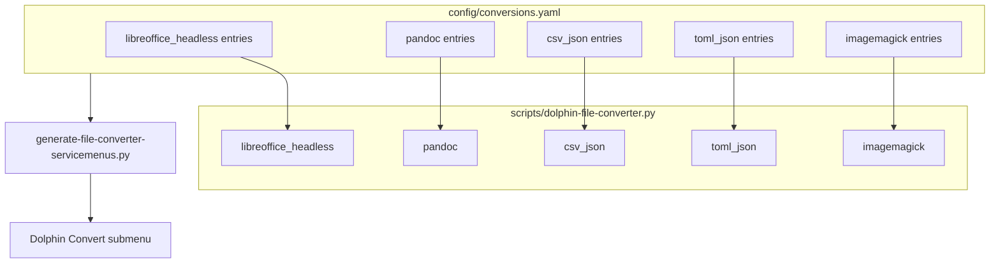

# feat: Expand common file conversion catalog

## Summary

Expand `kde-file-converter` with a batch of everyday format conversions—office documents, text/markup, tabular data, and common image swaps—using mostly registry entries and four small subprocess/stdlib engines. Keep implementations to one focused function per engine; favor **More…** over bloated featured menus.

## Problem Frame

The repo ships four conversions (PDF→MD, DOCX→PDF, YAML↔JSON). Users expect a broader but still lightweight catalog: the kinds of one-click transforms people do manually with LibreOffice, Pandoc, ImageMagick, or a few lines of Python. The architecture already supports this via `config/conversions.yaml` and the `ENGINES` dispatch table; the gap is catalog coverage and two missing engine types.

## Requirements

- R1: Add common office→PDF conversions reusing `libreoffice_headless` without engine changes.
- R2: Add text/markup conversions via a generic `pandoc` engine when `pandoc` is on PATH.
- R3: Add tabular conversions via a stdlib `csv_json` engine (CSV↔JSON; document JSON shape constraints).
- R4: Add TOML↔JSON via stdlib `toml_json` engine (Python 3.11+ `tomllib`).
- R5: Add common raster format swaps via an `imagemagick` engine (`magick` preferred, `convert` fallback).
- R6: New conversions appear in generated Dolphin menus only when dependencies are available (existing behavior).
- R7: Featured menu stays lean: at most one obvious action per source-type group; reverse or niche conversions default to picker-only (`featured: false`).
- R8: README and `docs/adding-conversions.md` list the expanded catalog and new engines.
- R9: Tests cover registry parsing for new IDs and at least one happy-path run per new engine (no Dolphin GUI tests).

## Key Technical Decisions

- KTD1: **Maximal-simple scope** — include office, text, data, and image families; skip audio/video, archives, and multi-step pipelines (see origin user choice).
- KTD2: **Reuse `libreoffice_headless` for all LO-supported exports to PDF** — registry-only entries for ODT, ODS, PPTX, XLSX, RTF, TXT, HTML (when LO is the simpler path). No per-format LO code.
- KTD3: **`pandoc` as a single generic engine** — `pandoc source -o target`; target format inferred from output extension. Covers MD↔HTML, MD→PDF, HTML→MD, etc.
- KTD4: **`csv_json` limits JSON→CSV to a top-level JSON array of objects** — document in registry comments and docs; avoids open-ended flattening logic.
- KTD5: **`toml_json` uses stdlib only** — no `tomli` dependency; require Python 3.11+ (already the project baseline).
- KTD6: **`imagemagick` engine** — `magick input output` or legacy `convert input output`; one registry entry per direction (png→jpg, jpg→png, webp→png, etc.).
- KTD7: **Featured policy** — new office→PDF entries for ODT/PPTX/XLSX get `featured: true`; text/image reverse directions and TOML/CSV niches get `featured: false`.

## Scope Boundaries

**In scope**

- Registry entries + engines listed in Implementation Units
- Unit tests for engines and registry IDs
- README conversion table update

**Deferred for later**

- EPUB, LaTeX, DOC (legacy binary Word), calendar/vCard formats
- OCR, PDF layout-preserving MD (pymupdf4llm), batch zip outputs
- Audio/video transcoding (separate domain; existing dolphin-audio-converter pattern)
- User-configurable featured flags / configure dialog

**Outside this product's identity**

- Non-KDE file managers, Nautilus actions, Windows Send To
- Cloud upload / send-to-device workflows

### Deferred to Follow-Up Work

- SVG→PNG via `rsvg-convert` as a separate engine if ImageMagick quality is insufficient
- `md-to-pdf` via LibreOffice as fallback when Pandoc is absent

---

## High-Level Technical Design

Most new work is YAML. Engine additions are thin subprocess/stdlib wrappers registered in `ENGINES`.

---

## Proposed Conversion Catalog

### Registry-only (engine: `libreoffice_headless`)

| id | Source | Target | featured |
|----|--------|--------|----------|
| odt-to-pdf | .odt | .pdf | true |
| ods-to-pdf | .ods | .pdf | false |
| pptx-to-pdf | .pptx | .pdf | true |
| xlsx-to-pdf | .xlsx | .pdf | true |
| rtf-to-pdf | .rtf | .pdf | false |
| txt-to-pdf | .txt | .pdf | false |

*(Existing `docx-to-pdf` unchanged.)*

### Pandoc (engine: `pandoc`, requires `pandoc`)

| id | Source | Target | featured |
|----|--------|--------|----------|
| md-to-html | .md | .html | true |
| html-to-md | .html, .htm | .md | false |
| md-to-pdf | .md | .pdf | false |

### Data (stdlib engines)

| id | Source | Target | engine | featured |
|----|--------|--------|--------|----------|
| csv-to-json | .csv | .json | csv_json | true |
| json-to-csv | .json | .csv | csv_json | false |
| tsv-to-csv | .tsv | .csv | csv_json | false |
| toml-to-json | .toml | .json | toml_json | true |
| json-to-toml | .json | .toml | toml_json | false |

### Images (engine: `imagemagick`, requires `magick` or `convert`)

| id | Source | Target | featured |
|----|--------|--------|----------|
| png-to-jpg | .png | .jpg | true |
| jpg-to-png | .jpg, .jpeg | .png | false |
| webp-to-png | .webp | .png | true |
| webp-to-jpg | .webp | .jpg | false |
| png-to-webp | .png | .webp | false |
| heic-to-jpg | .heic | .jpg | false |

*(HEIC entry omitted from menus when ImageMagick lacks HEIC delegate—fail gracefully at runtime with clear error.)*

---

## Implementation Units

### U1. Add four new conversion engines

**Goal:** Extend the backend with pandoc, csv_json, toml_json, and imagemagick dispatch functions.

**Requirements:** R2, R3, R4, R5

**Dependencies:** none

**Files:**
- `scripts/dolphin-file-converter.py`
- `tests/test_engines.py` (new)

**Approach:**
- `convert_pandoc(source, target)` — subprocess `pandoc` with stderr surfaced on failure.
- `convert_csv_json(source, target)` — CSV→JSON: `csv.DictReader` → `json.dump` list; JSON→CSV: require top-level list of dicts, write with `csv.DictWriter`; TSV→CSV: delimiter swap via stdlib.
- `convert_toml_json(source, target)` — `tomllib.loads` / `json.dumps` and reverse via `json.loads` + manual TOML write is non-trivial; for JSON→TOML use `tomli-w` only if needed—**prefer** emitting TOML via minimal stdlib string builder for flat dicts OR document JSON→TOML as deferred if too messy. **Revised:** JSON→TOML use `tomli_w` pip optional OR skip json-to-toml and ship toml-to-json only if stdlib-only is a hard constraint. **Decision:** ship both directions using `tomli_w` in `requirements.txt` (one small dep) OR use `tomllib` + `json` for toml→json only and json→toml as `featured: false` with `tomli_w`. Simplest: add `tomli-w` to requirements for json→toml.
- `convert_imagemagick(source, target)` — detect `magick` vs `convert`, run `[cmd, str(source), str(target)]`.
- Extend `package_available` if new pip deps added (`tomli-w`).
- Register all in `ENGINES`.

**Patterns to follow:** Existing `convert_libreoffice_headless` subprocess error handling; keep functions under ~25 lines each.

**Test scenarios:**
- Happy path: pandoc converts a one-line `.md` to `.html` (skip if pandoc absent, mark skipped).
- Happy path: csv_json round-trip on a 2-row CSV with headers.
- Happy path: toml_json converts `key = "value"` TOML to JSON.
- Happy path: imagemagick converts a 1×1 PNG to JPG (skip if magick absent).
- Error path: json-to-csv with JSON object (not array) raises clear RuntimeError.
- Error path: imagemagick with missing binary raises RuntimeError.

**Verification:** `python3 tests/test_engines.py` passes; engines importable from `ENGINES`.

---

### U2. Expand conversion registry

**Goal:** Add all catalog entries from the table above with correct mimetypes and featured flags.

**Requirements:** R1, R2, R3, R4, R5, R6, R7

**Dependencies:** U1

**Files:**
- `config/conversions.yaml`

**Approach:**
- Copy mimetypes from `mimetype -b` on sample files where non-obvious (document in commit message, not in YAML comments spam).
- Group-friendly: generator already groups by `source_extensions`; no generator changes expected.
- Set `requires_commands: [pandoc]` / `[magick, convert]` / `[libreoffice, soffice]` appropriately.
- Add `tomli-w` to `requires_packages` for json-to-toml if U1 uses it.

**Test scenarios:**
- Registry parse test asserts all new `id` values present (extend `tests/test_registry.py`).
- Generator smoke: `python3 scripts/generate-file-converter-servicemenus.py --registry config/conversions.yaml` writes N desktop files without error.

**Verification:** Install dry-run lists new menu files; spot-check PDF/MD/PNG groups in generated `.desktop` files.

---

### U3. Update dependencies and install notes

**Goal:** Document optional deps so users know what enables which conversions.

**Requirements:** R6, R8

**Dependencies:** U1, U2

**Files:**
- `requirements.txt`
- `install.sh` (warn lines for pandoc, imagemagick, tomli-w)
- `README.md`

**Approach:**
- Add `tomli-w` to requirements.txt if json-to-toml ships.
- Install script warns when `pandoc`, `magick`/`convert`, or `tomli_w` missing (mirror existing PyMuPDF/LibreOffice warnings).

**Test scenarios:** Test expectation: none — install script changes are advisory warnings only.

**Verification:** `./install.sh --apply` prints warnings on a minimal system without optional tools.

---

### U4. Documentation pass

**Goal:** Human-readable docs reflect the full catalog and engine list.

**Requirements:** R8

**Dependencies:** U2

**Files:**
- `README.md`
- `docs/adding-conversions.md`

**Approach:**
- README: replace inline table with grouped conversion list (Office / Text / Data / Images).
- adding-conversions.md: extend engine table; note csv_json JSON shape constraint and imagemagick HEIC caveat.

**Test scenarios:** Test expectation: none — documentation only.

**Verification:** New contributor can add a pandoc-based conversion by reading docs without reading Python source.

---

## Risks and Dependencies

| Risk | Mitigation |
|------|------------|
| Menu clutter from many featured actions | KTD7 featured policy; most new entries picker-only |
| JSON→CSV shape ambiguity | Document array-of-objects requirement; clear error message |
| HEIC/ImageMagick delegates missing | Runtime error + omit from menus if convert fails probe (optional install-time check) |
| Pandoc vs LibreOffice both offer MD→PDF | Pandoc primary; LO fallback deferred |
| TOML write without stdlib | Add `tomli-w` as optional pip dep |

**Prerequisites:** Python 3.11+, existing project install path; optional system packages pandoc, ImageMagick, LibreOffice.

---

## Verification Strategy

1. `python3 tests/test_registry.py -v`
2. `python3 tests/test_engines.py -v` (skips when CLI tools absent)
3. `./install.sh --apply` — regenerate servicemenus
4. Manual Dolphin spot-check: `.odt`, `.md`, `.csv`, `.png`, `.webp` each show **Convert** with expected featured actions

---

## Sources and Research

- Local: existing `config/conversions.yaml`, three engines in `scripts/dolphin-file-converter.py`, generator grouping in `scripts/generate-file-converter-servicemenus.py`
- Local: `docs/adding-conversions.md` pandoc worked example
- External research: skipped — repo patterns sufficient (10+ registry entries, 3 existing engines)
